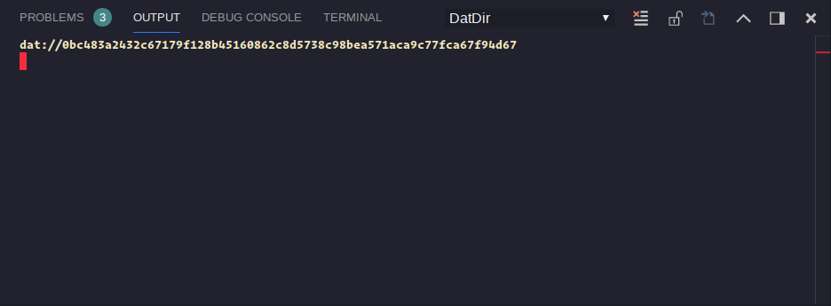
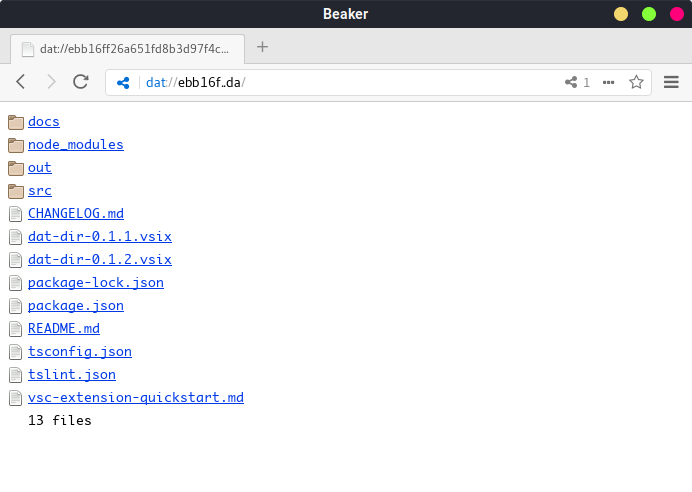

# DatDir
*The extension for sharing content with Dat!*

---

## Theres two commands

* Dat Share: Share the actual directory or whatever other directory that exists.
* Dat Clone: Clone a directory to the actual directory or whatever other directory.

## How it works

When you share a directory, all subdirectories and files are attached to Dat, a link is generated and you can use it to clone all files in another directory in the same computer or another computer.

You can access the Dat link in the notification or in the output panel as you can see below.

You can also access with BeakerBrowser.

The shared link still valid while your editor are open.

To clone a directory with dat, just paste the Dat link (dat://) or directly the hash.

